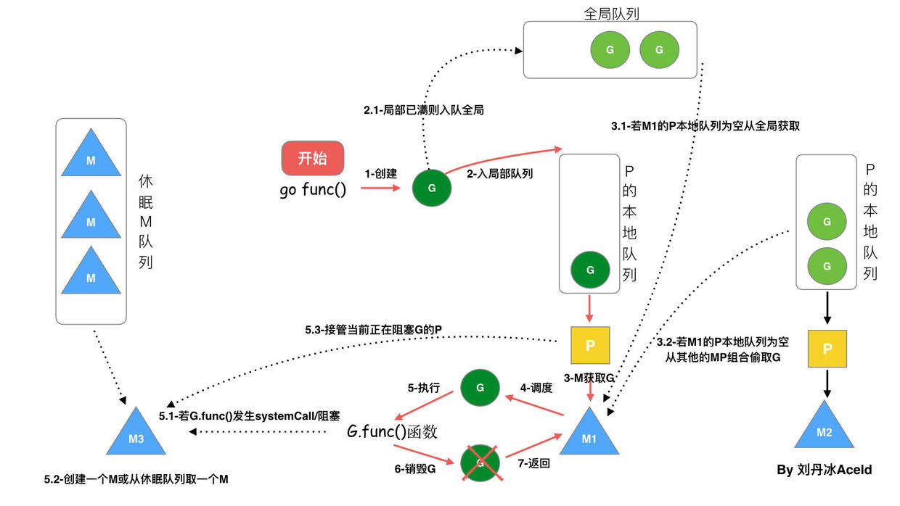

# GMP模型 

**goroutine 执行过程示意图**

从上图我们可以分析出几个结论：

 1、我们通过 go func()来创建一个goroutine；

 2、有两个存储G的队列，一个是局部调度器P的本地队列、一个是全局G队列。新创建的G会先保存在P的本地队列中，如果P的本地队列已经满了就会保存在全局的队列中；

 3、G只能运行在M中，一个M必须持有一个P，M与P是1：1的关系。M会从P的本地队列弹出一个可执行状态的G来执行，如果P的本地队列为空，就会想其他的MP组合偷取一个可执行的G来执行；

 4、一个M调度G执行的过程是一个循环机制；

 5、当M执行某一个G时候如果发生了syscall或则其余阻塞操作，M会阻塞，如果当前有一些G在执行，runtime会把这个线程M从P中摘除(detach)，然后再创建一个新的操作系统的线程(如果有空闲的线程可用就复用空闲线程)来服务于这个P；

 6、当M系统调用结束时候，这个G会尝试获取一个空闲的P执行，并放入到这个P的本地队列。如果获取不到P，那么这个线程M变成休眠状态， 加入到空闲线程中，然后这个G会被放入全局队列中。

